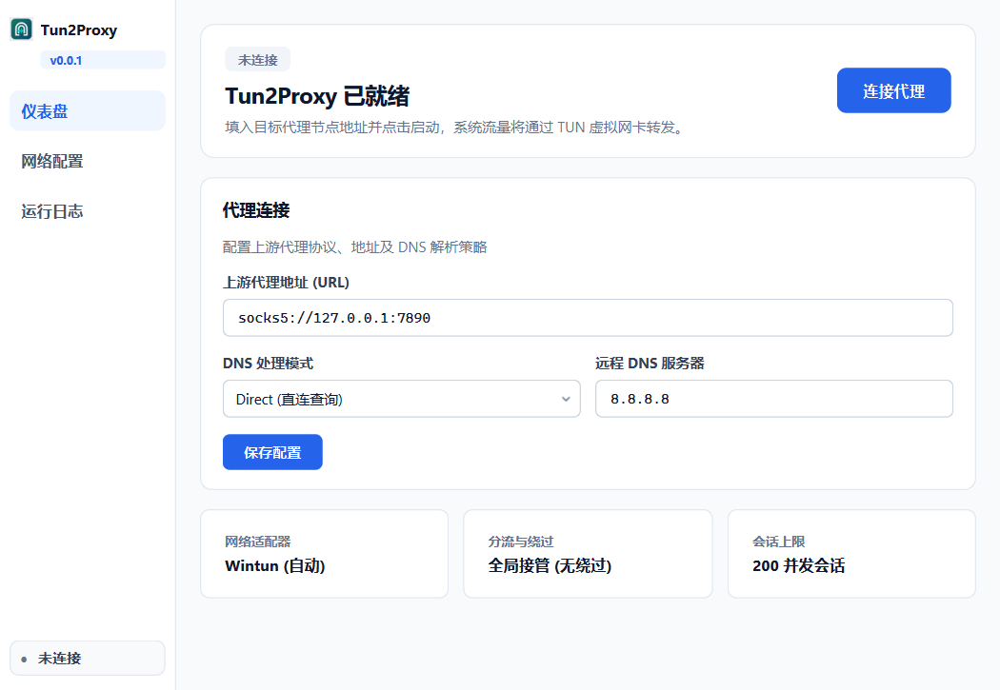

# Tun2Proxy GUI

桌面客户端，用于图形化启动和管理 [tun2proxy](https://github.com/tun2proxy/tun2proxy)。

支持：**Windows / Linux / macOS**（x86_64 与 aarch64）

当前版本：**0.0.2**（捆绑 tun2proxy **v0.8.3**）



## 功能

- 配置并启动 / 停止 `tun2proxy-bin`
- DNS 策略、绕过列表、日志等级等常用参数
- 配置持久化（各平台标准配置目录）
- 系统托盘（关闭窗口可最小化到托盘）
- 开机自启（Windows 注册表 / Linux `.desktop` / macOS LaunchAgent）
- 启动时请求提升权限（创建 TUN / 路由需要）

## 二进制布局

```
bin/
  windows/x86_64|aarch64/   tun2proxy-bin.exe, wintun.dll, …
  linux/x86_64|aarch64/     tun2proxy-bin, udpgw-server
  macos/x86_64|aarch64/     tun2proxy-bin, udpgw-server
```

运行时按当前 OS + CPU 架构自动选择。也兼容旧式扁平路径：`bin/<os>/` 或 `bin/`。

重新下载官方二进制（默认直连 GitHub）：

```powershell
# Windows
powershell -ExecutionPolicy Bypass -File .\scripts\fetch_binaries.ps1

# 仅当前平台 / 国内镜像示例
$env:TUN2PROXY_PLATFORM = "windows"
$env:TUN2PROXY_ARCH = "x86_64"
$env:TUN2PROXY_DOWNLOAD_PROXY = "https://ghproxy.net"
powershell -ExecutionPolicy Bypass -File .\scripts\fetch_binaries.ps1
```

```bash
# Linux / macOS
bash ./scripts/fetch_binaries.sh

export TUN2PROXY_PLATFORM=linux
export TUN2PROXY_ARCH=x86_64
export TUN2PROXY_DOWNLOAD_PROXY=https://ghproxy.net
bash ./scripts/fetch_binaries.sh
```

## 开发运行

### Windows

```powershell
cd e:\tun2proxy-gui
uv venv .venv
uv pip install -r requirements.txt
.\.venv\Scripts\python.exe main.py
```

### Linux / macOS

```bash
cd /path/to/tun2proxy-gui
python3 -m venv .venv
.venv/bin/pip install -r requirements.txt
.venv/bin/python main.py
```

可选参数：

| 参数 | 说明 |
|------|------|
| `--minimized` | 启动后隐藏到托盘 |
| `--no-elevate` | 跳过提权提示（调试用） |

## 打包分发

### 本地

```powershell
# Windows（便携目录）
powershell -ExecutionPolicy Bypass -File .\scripts\build.ps1

# Windows（引导式安装程序，依赖 Inno Setup 6）
powershell -ExecutionPolicy Bypass -File .\scripts\build_installer.ps1
```

```bash
# Linux / macOS
bash ./scripts/build.sh
```

产物：

| 产物 | 路径 |
|------|------|
| 便携目录 | `dist/Tun2ProxyGUI/` |
| Windows 安装包 | `dist/Tun2ProxyGUI-Setup-<version>-windows-x86_64.exe` |

打包仅捆绑当前平台/架构的 `bin/`。

> Windows 打包产物启用 `uac_admin`，运行时会弹出 UAC。安装程序默认以管理员权限安装到「程序文件」，可选桌面快捷方式与开机自启。

### GitHub Actions

仓库已配置 [`.github/workflows/build.yml`](.github/workflows/build.yml)：

| 触发 | 行为 |
|------|------|
| `push` / `pull_request`（`main`） | 构建 Win / Linux / macOS 产物；Windows 额外上传 `Tun2ProxyGUI-Setup-windows-x86_64` 安装包 Artifact |
| `workflow_dispatch` | 手动构建 |
| 推送 tag `v*`（如 `v0.0.2`） | 构建全部平台并创建 GitHub Release（含 `.zip` 与 `.exe` 安装包） |

发版示例：

```bash
git tag v0.0.2
git push origin v0.0.2
```

## 使用说明

1. **以提升权限运行**（Windows UAC / Linux pkexec·sudo / macOS 管理员密码）。
2. 填写代理地址，例如 `socks5://127.0.0.1:1080`。
3. 按需选择 DNS 策略并填写绕过 IP/CIDR。
4. 点击「启动代理」，日志区域可查看输出。
5. 右键托盘图标可启停或退出。

## 配置文件位置

| 平台 | 路径 |
|------|------|
| Windows | `%APPDATA%\tun2proxy-gui\config.json` |
| macOS | `~/Library/Application Support/tun2proxy-gui/config.json` |
| Linux | `~/.config/tun2proxy-gui/config.json` |

## 目录结构

```
tun2proxy-gui/
  main.py
  app/
  bin/windows|linux|macos/<arch>/
  docs/
  installer/windows/Tun2ProxyGUI.iss
  resources/
  .github/workflows/build.yml
  build.spec
  scripts/build.ps1
  scripts/build_installer.ps1
  scripts/build.sh
  scripts/fetch_binaries.ps1
  scripts/fetch_binaries.sh
  requirements.txt
```

## 权限说明

Tun2Proxy 需要提升权限以创建 TUN 并管理系统路由。若拒绝提权，程序仍可打开界面，但启动代理通常会失败。

## 许可证

GUI 代码以本仓库为准；`bin/` 内二进制遵循 [tun2proxy](https://github.com/tun2proxy/tun2proxy) 及其依赖的许可证（含 WinTun）。
